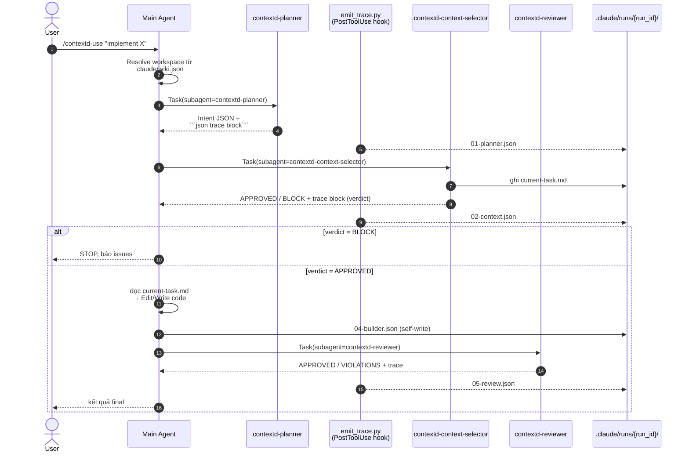
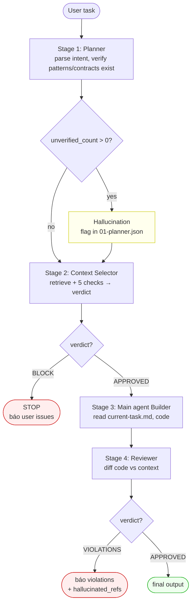

# Pipeline Visual — How the Wiki Works

> Tài liệu trực quan giải thích **wiki-driven pipeline** vận hành thế nào khi user chạy `/contextd-use "..."`.
> Đọc cùng [README.md](README.md), [multi-agent-pipeline.md](multi-agent-pipeline.md), [observability.md](observability.md).

---

## TL;DR — 4 câu hỏi pipeline trả lời

| # | Câu hỏi | Stage trả lời |
|---|---------|----------------|
| 1 | Task này cần pattern/contract nào? | Stage 1 (Planner) |
| 2 | Wiki có gì để dùng cho task này? + Plan đủ thông tin để code chưa? | Stage 2 (Context Selector — gồm cả verdict) |
| 3 | Code sinh ra có vi phạm contract không? | Stage 4 (Reviewer) |

Stage 3 (Builder) là main agent dùng kết quả 1-2 để code. Trace chạy ngầm, ghi JSON cho mọi stage.

---

## Sequence diagram — flow chi tiết



**Đọc diagram**: mũi tên đặc = LLM call, mũi tên đứt nét = file I/O. Hook `emit_trace.py` chạy mỗi khi Task tool kết thúc — main agent không phải tự ghi trace cho subagent.

---

## Decision flow — khi nào BLOCK / VIOLATIONS



**Hai gate quan trọng**:
- **Context-Selector verdict (Stage 2)** — chặn TRƯỚC khi tốn token cho Builder. Lý do: code đã viết sai → đắt để fix.
- **Reviewer (Stage 4)** — chặn TRƯỚC khi user merge. Phát hiện cả violation lẫn hallucinated reference (code reference doc không có trong context).

---

## Stage cheat sheet

| Stage | Agent file | Input | Output (LLM) | Output (file) | Câu hỏi trả lời |
|-------|-----------|-------|--------------|---------------|------------------|
| 0 | Main agent | user task | resolved workspace | `.claude/wiki.json` đọc | Workspace nào active? |
| 1 | [contextd-planner](../../.claude/agents/contextd-planner.md) | user_task, workspace | Intent JSON | `01-planner.json` | Task cần pattern/contract nào? |
| 2 | [contextd-context-selector](../../.claude/agents/contextd-context-selector.md) | intent JSON | APPROVED/BLOCK + retrieval data | `02-context.json` (gồm `verdict`) + `.claude/context/current-task.md` | Wiki có gì để dùng? + Plan đủ thông tin chưa? |
| 3 | Main agent (Builder) | current-task.md | code + Markdown sections | `04-builder.json` (self-write) | Code thế nào dựa trên context? |
| 4 | [contextd-reviewer](../../.claude/agents/contextd-reviewer.md) | code + context_file | APPROVED/VIOLATIONS | `05-review.json` | Code có vi phạm contract? |
| roll-up | hook | every stage | — | `run.json` | Tổng kết run |

**Các signal đáng debug** (xem nhanh trong trace JSON):
- `01-planner.unverified_count > 0` → planner đề xuất pattern không tồn tại trong wiki
- `02-context.gaps[].blocking_hint == true` → wiki thiếu doc cần thiết
- `02-context.verdict == "BLOCK"` → plan không khả thi với wiki hiện có
- `05-review.hallucinated_refs[]` không rỗng → builder reference doc không có trong context (= hallucination)
- `04-builder.assumptions_count > 0` → builder phải tự đoán, dấu hiệu wiki còn gap

---

## File artifact map — đâu lưu cái gì

```
{project_dir}/
├── .claude/
│   ├── wiki.json                       ← workspace active config
│   ├── context/
│   │   └── current-task.md             ← Stage 2 output, Stage 4 input
│   └── runs/
│       └── {run_id}/                   ← per-run trace dir
│           ├── run.json                ← roll-up (hook tự update)
│           ├── 01-planner.json
│           ├── 02-context.json         ← gồm verdict APPROVED|BLOCK
│           ├── 04-builder.json         ← main agent self-write
│           └── 05-review.json
{wiki_root}/                            ← repo này (wiki-template)
├── agents/                             ← engine prompts (chung mọi workspace)
├── scripts/emit_trace.py               ← PostToolUse hook
└── workspaces/{workspace}/             ← scope retrieval Stage 2
    ├── patterns-index.md               ← Stage 1 đọc để verify
    ├── platform/contracts/             ← Stage 2 retrieve, Stage 5 check
    ├── platform/patterns/              ← Stage 2 retrieve
    └── domains/                        ← Stage 2 retrieve
```

`run_id` format: `{YYYY-MM-DD}-{HHMMSS}-{slug}`. Slug = 4-6 từ đầu task, lowercase, `[a-z0-9-]` only. Chi tiết: [observability.md#L22-L33](observability.md#L22-L33).

---

## Cách "thấy" pipeline đang chạy gì

1. **Mở 2 terminal**:
   - Terminal A: chạy `/contextd-use "..."` (pipeline chính)
   - Terminal B: `ls -la .claude/runs/$(ls -t .claude/runs/ | head -1)/` — refresh để thấy file JSON drop dần

2. **Sau khi run xong** — debug:
   - `/contextd-trace --last` → Markdown timeline 1 run
   - `/contextd-viz --last` → HTML viewer (Phase 2 — nếu đã setup) với side-by-side retrieved-vs-used, hallucination panel
   - `cat .claude/runs/{run_id}/05-review.json | jq .hallucinated_refs` → xem hallucination thô

3. **Aggregate nhiều runs**:
   - `/contextd-eval` → Markdown report: hallucination rate, top gaps, block rate
   - `/contextd-viz --all` → HTML browser (Phase 2) với filter

---

## Khi nào pipeline KHÔNG chạy

- Task không có wiki (`.claude/wiki.json` thiếu) → main agent yêu cầu `/contextd-setup`
- Task user explicitly bypass: "no pipeline", "quick fix", typo fix
- Task `design`/`review` không sinh code → có thể skip Stage 5

Xem [multi-agent-pipeline.md#L171-L181](multi-agent-pipeline.md#L171-L181) cho exception list.

---

## Related

- [README.md](README.md) — pipeline overview + reference index
- [multi-agent-pipeline.md](multi-agent-pipeline.md) — vai trò + schema từng agent
- [observability.md](observability.md) — trace schema + hook contract
- [run-trace.schema.json](../../templates/run-trace.schema.json) — JSON schema cho mọi trace file
- [.claude/commands/contextd-use.md](../../.claude/commands/contextd-use.md) — execution flow chính thức
- [.claude/commands/contextd-trace.md](../../.claude/commands/contextd-trace.md) — Markdown 1-run viewer
- [.claude/commands/contextd-eval.md](../../.claude/commands/contextd-eval.md) — Markdown aggregate
- `.claude/commands/contextd-viz.md` — HTML viewer (Phase 2, nếu đã add)
